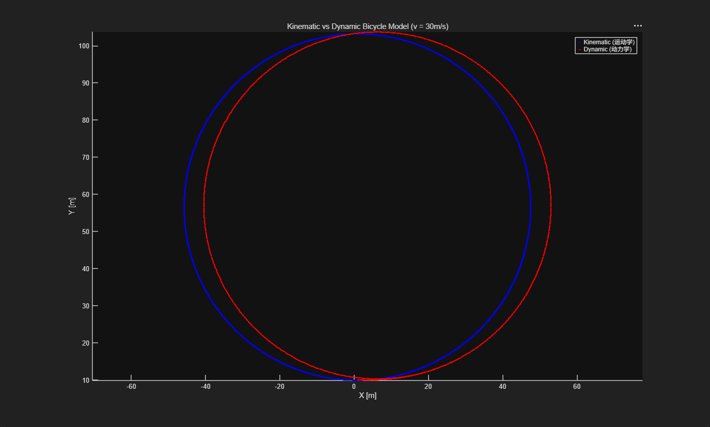
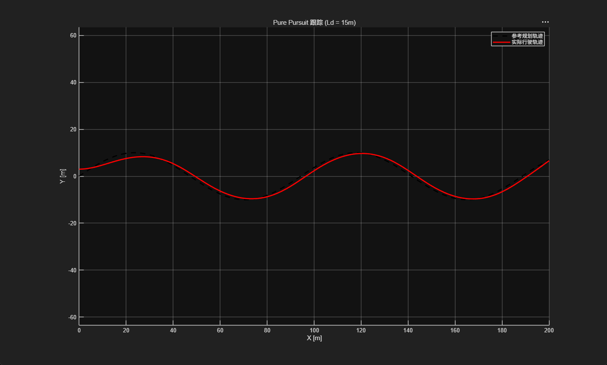
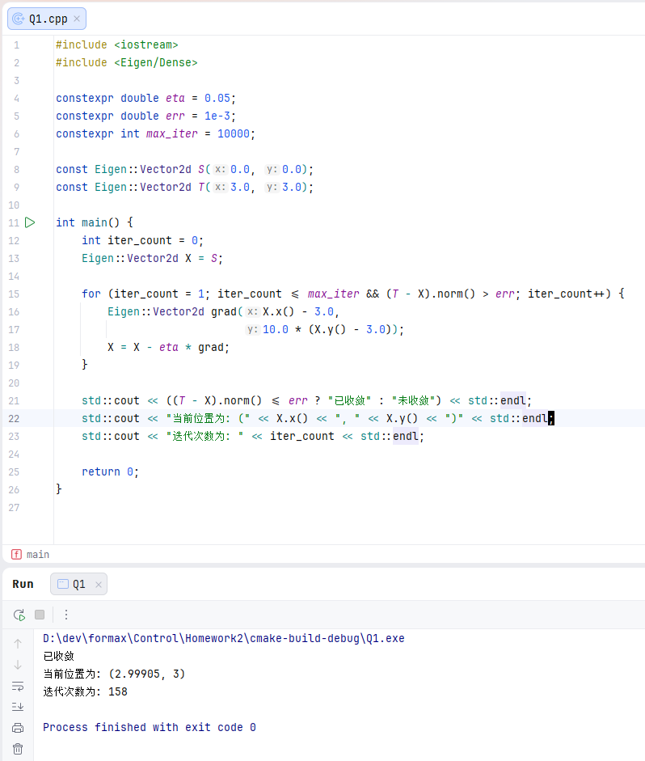
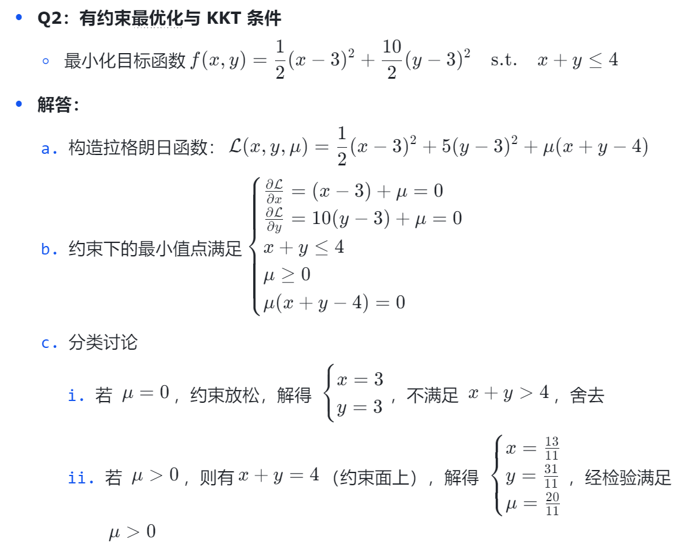
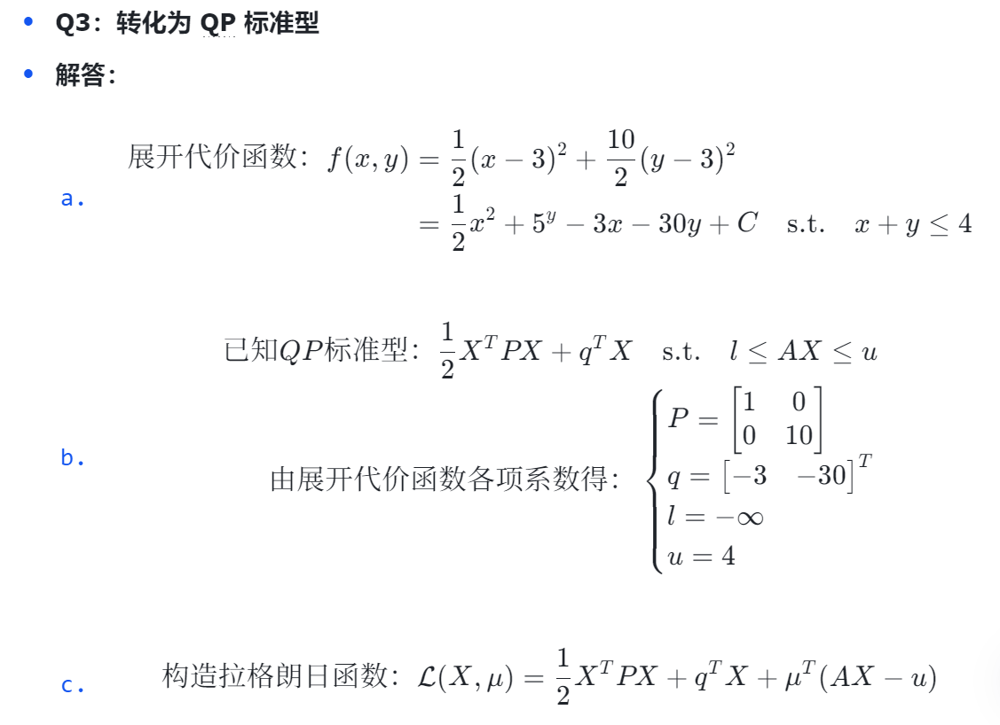
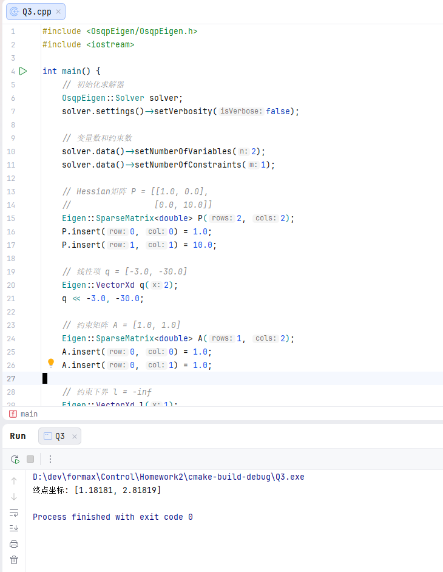

# 2026 SCUT Racing招新最优化与控制作业

飞书笔记：https://my.feishu.cn/docx/PI1FdPmcaogIptx8WgkcXm53nHd?from=from_copylink

## AI使用情况

- 视频讲述不清晰：
    - 使用AI解释KKT条件，
    - 使用AI联系KKT和拉格朗日函数的关系，
    - 使用AI把传统KKT转化为QP标准型形式的推导
    - 使用AI对以上数学公式输出可复制的latex文本（然后汇总成飞书文档）
- 不会matlab：只会推导部分运动学自行车模型，使用AI对代码进行语法纠错
- 不会动力学模型：完全使用AI编写公式推导

## 运动学自行车模型

状态更新：
$$
\begin{aligned}
\dot{\phi} &= \frac{v \cdot \tan(\sigma)}{L} \\
\phi_{k+1} &= \phi_k + \dot{\phi} \cdot \Delta t \\
x_{k+1} &= x_k + v \cdot \cos\phi \cdot \Delta t \\
y_{k+1} &= y_k + v \cdot \sin\phi \cdot \Delta t
\end{aligned}
$$

## 动力学模型

1. 前后轮侧偏角：
   $$
   \begin{aligned}
   \alpha_f &= \sigma - \frac{\dot{y} + l_f \cdot \dot{\phi}}{\dot{x}} \\
   \alpha_r &= -\frac{\dot{y} - l_r \cdot \dot{\phi}}{\dot{x}}
   \end{aligned}
   $$
2. 轮胎侧向力
   $$
   \begin{aligned}
   F_{yf} &= C_f \cdot \alpha_f \\
   F_{yr} &= C_r \cdot \alpha_r
   \end{aligned}
   $$
3. 牛顿第二定律
   $$
   \begin{aligned}
   \ddot{y} &= \frac{F_{yf} + F_{yr}}{m} \\
   \ddot{\phi} &= \frac{l_f \cdot F_{yf} - l_r \cdot F_{yr}}{I_z}
   \end{aligned}
   $$

## 曲线跟踪

### 思路

取车头正前方固定距离的一点（假设为$L_d=3$），
取跟踪线上距离这个点最近的一点（近似前瞻距离为$L_d$）作为目标进行跟踪

### 计算

1. 地面坐标系下，横向误差：
   $$
   \begin{align}
   已知：\Delta x &= x_t - x \\
   \Delta y &= y_t - y \\
   得：e &= \Delta y \cdot \cos\phi - \Delta x \cdot \sin\phi
   \end{align}
   $$
2. 前轮转向角：
   $$
   \sigma = \arctan\left(\frac{2L \cdot e}{L_d^2}\right)
   $$

## 机器狗寻优

### Q1：无约束寻优

### Q2：有约束最优化与KKT条件

### Q2：OSQP二次规划求解

