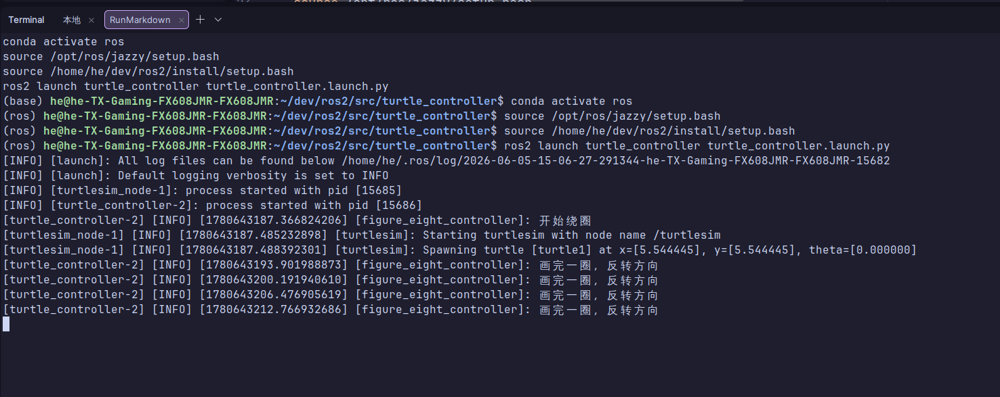
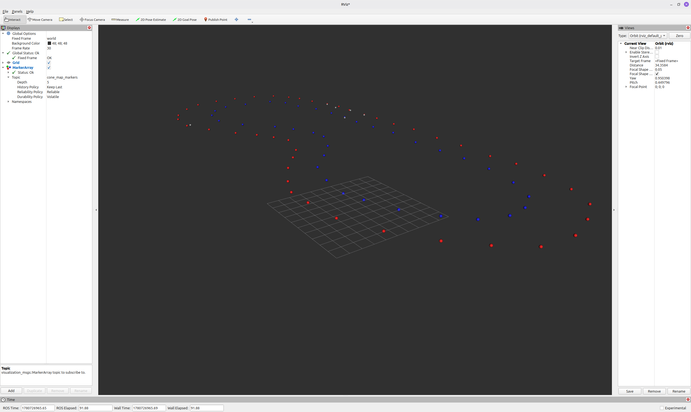

# 2026 SCUT Racing招新ROS作业

飞书笔记：https://my.feishu.cn/docx/Gweydaeu5orLPax3yX1c2RdqnMe?from=from_copylink

AI与困难：

1. 很讨厌，六月份 *github copilot* 的计算方案变了，聊两句token就烧干了
2. 不太清楚这个 bag 里面回访的 frame_id 是什么，如果在 rviz 里面设置为map就会报错，
   在通义灵码的帮助下，学会使用ros2 echo 命令查看bag里面frame_id，改成world就能正常显示
3. 很烦那个 tf 的警告`Frame [world] does not exist`，在通义灵码的帮助下
   （实际上是这里直接vibe coding了）， 向 tf 广播声明 `world` 的存在

## Basic（海龟八字绕圈）

### 解决思路

1. 控制海龟说明，需要订阅海龟的信息、向海龟发布指令
2. 画完一个圆后(累计角度)，改变角速度向另一个方向画圆，模拟8字绕圈

### 构建

以我的环境(conda, jazzy, 工作区在 ~/dev/ros2)为例

```bash
conda activate ros
source /opt/ros/jazzy/setup.bash
cd ~/dev/ros2
colcon build --packages-select turtle_controller
source install/setup.bash
```

### 运行

以我的环境(conda, jazzy, 工作区在 ~/dev/ros2)为例

```bash
conda activate ros
source /opt/ros/jazzy/setup.bash
source /home/he/dev/ros2/install/setup.bash
ros2 launch turtle_controller turtle_controller.launch.py
```

### 停止

```bash
pkill -SIGINT -u "$(whoami)" -f "turtlesim_node|turtle_controller|rviz2"
```

### 参数

参数名称：`config_file`

```bash
ros2 launch turtle_controller turtle_controller.launch.py config_file:=/absolute/path/to/your.yaml
```

### 节点输出信息



## Advanced（锥桶地图可视化）

### 构建

在工作空间根目录执行：

```bash
conda activate ros
source /opt/ros/jazzy/setup.bash
cd ~/dev/ros2
colcon build --packages-select fsd_common_msgs cone_map_visualizer
source install/setup.bash
```

### 运行

#### 启动可视化节点：

```bash
conda activate ros
source /opt/ros/jazzy/setup.bash
ros2 launch cone_map_visualizer cone_map_visualizer.launch.py
```

#### 播放给定 bag：

```bash
conda activate ros
source /opt/ros/jazzy/setup.bash
ros2 bag play /home/he/dev/ros2/src/map_to_visualize
```

#### 打开 RViz2：

```bash
rviz2
```

在 RViz2 中：

- 将 `Fixed Frame` 设为 `world`（或 bag 实际使用的 frame）
- `MarkerArray` 订阅话题 `/cone_map_markers`

### 停止

```bash
pkill -SIGINT -u "$(whoami)" -f "turtlesim_node|turtle_controller|rviz2"
```

### 参数

参数名称：`config_file`

```bash
ros2 launch cone_map_visualizer cone_map_visualizer.launch.py config_file:=/absolute/path/to/your.yaml
```

### 可视化结果


